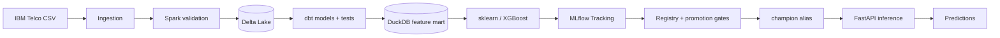
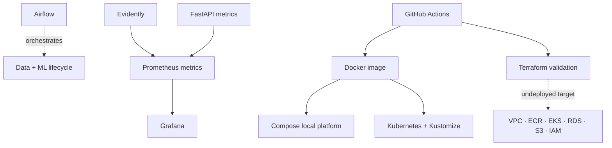

# MLOps Customer Churn Platform

[](https://github.com/CerenDc/mlops-customer-churn-platform/actions/workflows/ci.yml)
[](https://www.python.org/)
[](https://www.docker.com/)
[](https://kubernetes.io/)
[](https://www.terraform.io/)
[](LICENSE)

Production-style end-to-end MLOps platform for customer churn prediction,
covering data processing, tested feature engineering, model training and
promotion, REST inference, orchestration, containerization, Kubernetes
deployment, observability, CI, and validated AWS Infrastructure as Code.

**Python · Spark · Delta Lake · dbt · DuckDB · scikit-learn · XGBoost · MLflow · Airflow · FastAPI · Docker · Kubernetes · Evidently · Prometheus · Grafana · Terraform · AWS · GitHub Actions**

> Portfolio implementation: local and CI paths are exercised; AWS is an
> undeployed target architecture. The repository does not claim to serve real
> production users or automatically provision paid infrastructure.

## Why this project exists

Customer churn reduces recurring revenue and increases acquisition costs. The
useful engineering problem is not only predicting churn—it is building a
traceable path from raw customer data to a governed, observable prediction.
This repository demonstrates that complete lifecycle with explicit contracts
and independently testable components.

## Architecture





The Airflow pipeline is:

```text
prepare_raw_data → spark_processing → dbt_build → train_models
                 → registry_lifecycle → verify_champion
```

The API loads the complete registered sklearn pipeline through
`models:/<registered-model>@champion`. It returns HTTP 503 if a champion cannot
be loaded; it never returns a fabricated fallback prediction.

## What this project demonstrates

- Typed Spark processing and transactional Delta storage.
- Tested SQL lineage and customer-grain features with dbt/DuckDB.
- Leakage-safe preprocessing embedded in sklearn model pipelines.
- Reproducible logistic-regression and XGBoost comparison.
- MLflow lineage, signatures, artifacts, Registry versions, and aliases.
- Deterministic champion/challenger promotion with quality guardrails.
- Genuine Airflow orchestration of the full synthetic and real-data paths.
- Typed FastAPI inference with OpenAPI, readiness, and Prometheus metrics.
- Evidently drift analysis plus provisioned Prometheus/Grafana observability.
- One reusable Docker image, a Compose platform, and Kustomize deployments.
- CI that exercises the synthetic lifecycle without cloud credentials.
- Modular, cost-conscious Terraform for an undeployed AWS target.

## Quick start

### Python development

Prerequisites: Python 3.13, Java 17, and Git.

```bash
python3.13 -m venv .venv
source .venv/bin/activate
python -m pip install --upgrade pip
python -m pip install -e ".[dev,orchestration]"
cp .env.example .env
pytest -q
ruff check .
ruff format --check .
```

The `.env` file and generated data are ignored. The real IBM Telco dataset is
downloaded only when explicitly running real-data mode.

### Complete local platform

Prerequisite: Docker Compose v2.

```bash
cp .env.example .env
docker compose build
docker compose up -d
docker compose ps
```

| Service | URL | Purpose |
| --- | --- | --- |
| Airflow | <http://localhost:8080> | DAG orchestration and logs |
| MLflow | <http://localhost:5000> | Experiments, artifacts, Registry |
| Prediction API | <http://localhost:8001/docs> | OpenAPI and champion inference |
| Prometheus | <http://localhost:9090> | Pipeline and serving metrics |
| Grafana | <http://localhost:3000> | Provisioned MLOps dashboard |

The example Grafana login is `admin` / `grafana-dev-only`. Retrieve Airflow’s
generated local development password with:

```bash
docker compose exec airflow-api-server \
  cat /opt/mlops/data/airflow/simple_auth_manager_passwords.json.generated
```

Trigger the synthetic DAG before requesting a prediction so that MLflow has a
real champion:

```bash
docker compose exec airflow-scheduler \
  airflow dags trigger mlops_customer_churn_pipeline
curl --fail http://localhost:8001/health
curl --fail http://localhost:8001/model/info
```

The complete valid `/predict` payload and interview walkthrough are in
[`docs/DEMO.md`](docs/DEMO.md).

Stop services without deleting state:

```bash
docker compose down
```

`docker compose down --volumes` is intentionally destructive to local demo
databases and artifacts.

## Data and model contracts

The feature mart contains one row per customer. Identifiers and both target
representations are excluded from training. Numeric fields are median-imputed;
categorical fields are most-frequent-imputed and one-hot encoded with unknown
categories ignored. Every fitted transformation is stored inside the registered
model pipeline.

Training makes deterministic 70/15/15 stratified splits. Validation selects a
candidate; the untouched test partition supplies final metrics. Promotion uses
configurable absolute ROC-AUC, F1, and recall floors plus incumbent-relative
guardrails. The Registry lifecycle registers once, assigns aliases, reloads the
champion, and validates real predictions.

## Monitoring

```bash
python -m churn_platform.monitoring.run --scenario normal
python -m churn_platform.monitoring.run --scenario drifted
```

Evidently detects feature-distribution drift. Monitoring also exposes data,
model, Airflow, and dbt status. FastAPI adds request, failure, prediction-class,
and inference-latency metrics. Prometheus scrapes both endpoints and Grafana
loads the dashboard from version-controlled JSON. Drift recommends action; it
does not automatically retrain or promote a model.

## Kubernetes

The `k8s/base` manifests include PostgreSQL, Airflow, MLflow, serving,
Prometheus, Grafana, and persistent storage. The local kind overlay supplies
explicit disposable demo credentials; the AWS overlay removes local PostgreSQL,
uses ECR/RDS/S3 configuration, and references runtime-provided secrets.

Render without a cluster:

```bash
kubectl kustomize k8s/overlays/local >/tmp/churn-local.yaml
kubectl kustomize k8s/overlays/aws >/tmp/churn-aws.yaml
```

Local kind deployment:

```bash
kind create cluster --name churn-mlops --config k8s/kind-config.yaml
docker build -t churn-mlops:local .
kind load docker-image churn-mlops:local --name churn-mlops
kubectl apply -k k8s/overlays/local
kubectl get pods,svc -n churn-mlops
```

This PVC layout targets a single-node portfolio demo; `ReadWriteOnce` is not
presented as production multi-node shared storage.

## AWS Infrastructure as Code

Terraform defines one dev environment with a two-AZ VPC, private EKS nodes,
immutable ECR, private encrypted RDS PostgreSQL, private versioned S3 artifacts,
Secrets Manager, and bucket-scoped IRSA roles. Defaults are cost-conscious but
not free: EKS, EC2, NAT Gateway, RDS, EBS, storage, and transfer can incur cost.

Safe local validation:

```bash
cd infra/terraform/environments/dev
terraform fmt -check -recursive ../..
terraform init -backend=false
terraform validate
```

No CI workflow runs `terraform plan` or `apply`. See
[`docs/aws-architecture.md`](docs/aws-architecture.md) for security, storage,
cost, and persistence boundaries.

## Continuous integration

`MLOps Continuous Integration` runs on pull requests to `main` and pushes to
development/feature/fix branches. It validates Ruff, component tests, Spark and
Delta integration, Airflow DAG discovery, a genuine end-to-end synthetic DAG,
normal/drifted monitoring, Compose, local/AWS Kustomize renders, the Docker
runtime, and Terraform fmt/init/validate. Repository permissions are read-only;
AWS credentials and deployment are not part of CI.

## Real-data mode

The existing ingestion path remains available:

```bash
CHURN_PIPELINE_USE_SYNTHETIC_DATA=false airflow dags test \
  mlops_customer_churn_pipeline \
  --dagfile-path "$PWD/orchestration/dags/churn_mlops_pipeline.py"
```

This mode was validated with the actual 7,043-row IBM Telco dataset. The data is
not committed, and CI intentionally uses a deterministic 60-row fixture.

## Repository structure

```text
.
├── src/churn_platform/
│   ├── ingestion/          # IBM Telco acquisition and validation
│   ├── spark/              # typed Spark → Delta processing
│   ├── ml/                 # training, tracking, promotion, registry
│   ├── orchestration/      # Airflow command/configuration helpers
│   ├── monitoring/         # Evidently and metrics publication
│   └── serving/            # FastAPI champion inference
├── orchestration/dags/     # pipeline and monitoring DAGs
├── dbt_project/            # transformations, tests, feature mart
├── monitoring/             # Prometheus and Grafana as code
├── k8s/                    # base plus local/AWS Kustomize overlays
├── infra/terraform/        # AWS modules and dev environment
├── tests/                  # component and integration tests
├── docs/                   # demo, decisions, interview, portfolio
├── Dockerfile
├── docker-compose.yml
└── .github/workflows/ci.yml
```

## Documentation

- [Architecture decisions](docs/architecture-decisions.md)
- [Complete demo guide](docs/DEMO.md)
- [Technical interview cheat sheet](docs/INTERVIEW.md)
- [AWS architecture](docs/aws-architecture.md)
- [Portfolio/CV/Malt/LinkedIn copy](docs/PORTFOLIO.md)
- [Screenshot checklist](docs/assets/README.md)

## Current status and limitations

**V13 — Model Serving and Portfolio Finalization.** The repository implements a
real FastAPI inference layer, but remains a portfolio system. AWS is not
deployed; no public ingress/TLS, managed secret synchronization, HA proof, load
benchmark, production SLO, restore drill, or automated CD is claimed. Local
Spark/DuckDB and PVC assumptions are documented rather than disguised. A
running API caches the resolved champion until it restarts; automated hot
refresh after alias promotion is a future serving improvement.

## License

[MIT](LICENSE)
