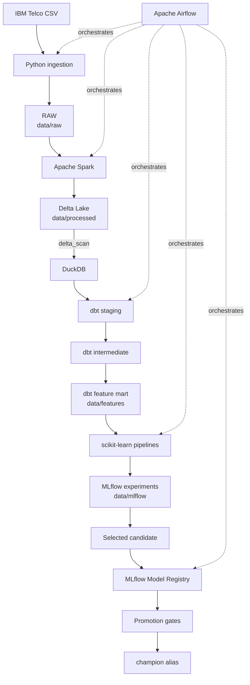

# MLOps Customer Churn Platform

[](https://www.python.org/)
[](https://github.com/CerenDc/mlops-customer-churn-platform/actions/workflows/ci.yml)
[](#project-status)

A portfolio project that incrementally builds a production-style, end-to-end
MLOps platform for predicting customer churn.

## Business problem

Customer churn reduces recurring revenue and increases the cost of replacing
departed customers. A reliable churn signal can help retention teams identify
at-risk customers early, prioritize outreach, and measure the impact of
interventions.

## Project objective

Build a maintainable platform that ingests customer data, creates reproducible
features, trains and evaluates churn models, deploys predictions, and monitors
data and model quality. Each capability will be introduced in a small,
testable version so the operational decisions remain understandable.

## Architecture



V7 adds a manually triggered Airflow DAG around the independently executable
data, training, and lifecycle components. Serving remains future work.

## Technology roadmap

| Phase | Planned focus | Candidate technologies |
| --- | --- | --- |
| V1 | Python project foundation, linting, and tests | Python 3.13, pytest, Ruff |
| V1.1 | Developer automation and continuous integration | GitHub Actions, VS Code tasks |
| V2 | Reproducible data ingestion and validation | pandas, HTTPX |
| V3 | Typed local processing and transactional storage | Apache Spark, Delta Lake |
| V4 | SQL modeling, analytical quality, documentation, and lineage | dbt, DuckDB |
| V5 | Model training, evaluation, and experiment tracking | scikit-learn, XGBoost, MLflow |
| V6 | Model versioning and champion/challenger lifecycle | MLflow Model Registry |
| V7 | Workflow orchestration | Apache Airflow 3 |
| V8 (current) | CI/CD industrialization | GitHub Actions, synthetic integration pipeline |
| V9 | Packaging, serving, and observability | Docker, API framework, monitoring stack |

The roadmap is directional. Technology choices will be evaluated when their
phase begins rather than installed in advance.

## Local setup

Prerequisites: Python 3.13, Java 17, and Git.

On Apple Silicon macOS with Homebrew, install and expose Java 17 with:

```bash
brew install openjdk@17
export JAVA_HOME="/opt/homebrew/opt/openjdk@17/libexec/openjdk.jdk/Contents/Home"
export PATH="$JAVA_HOME/bin:$PATH"
```

Linux and CI environments may provide Java 17 through their normal JDK
distribution. Confirm the active runtime with `java -version`.

```bash
python3.13 -m venv .venv
source .venv/bin/activate
python -m pip install --upgrade pip
python -m pip install -e ".[dev]"
cp .env.example .env
```

Install the isolated orchestration extra only when working with Airflow:

```bash
python -m pip install -e ".[dev,orchestration]"
```

Run the quality checks:

```bash
pytest -q
ruff check .
ruff format --check .
```

The `.env` file is ignored by Git. Do not store secrets in `.env.example`.

The same checks can be launched in VS Code from **Tasks: Run Task** by choosing
**Quality Check**.

## Continuous Integration

The [`.github/workflows/ci.yml`](.github/workflows/ci.yml) workflow validates
pull requests targeting `main` and pushes to `develop`, `feature/**`, and
`fix/**`. It checks Python imports, Ruff linting and formatting, the pytest
suite, Spark with Delta Lake, dbt models and tests, ML training, MLflow
tracking, the Model Registry lifecycle, and Airflow DAG integrity. One genuine
Airflow run then exercises the complete synthetic pipeline from RAW data to
champion-model reload and prediction, without external datasets or services.

CI uses Python 3.13, Temurin Java 17, pip caching, isolated runner-temporary
paths, a local DuckDB feature mart, and an SQLite MLflow backend. Obsolete runs
on the same branch or pull request are cancelled automatically. Real-data
execution remains separate and available locally with:

```bash
CHURN_PIPELINE_USE_SYNTHETIC_DATA=false airflow dags test \
  mlops_customer_churn_pipeline \
  --dagfile-path "$PWD/orchestration/dags/churn_mlops_pipeline.py"
```

## V2 data ingestion

V2 downloads the public IBM Telco Customer Churn CSV, validates its schema and
key business constraints, and atomically saves the accepted file. Run it from
the repository root after completing the local setup:

```bash
python -m churn_platform.ingestion.telco
```

The downloaded file is written to `data/raw/telco_customer_churn.csv`. Raw data
is reproducible from the public source and can be large, so it is deliberately
ignored by Git; only the `.gitkeep` placeholder is versioned.

No cleaning, feature engineering, or model work occurs during ingestion.

## V3 — Spark + Delta Lake

Spark provides a distributed-style DataFrame processing model locally and
prepares the project for processing patterns used on larger data platforms. V3
uses an explicit schema, normalizes field types, safely parses `TotalCharges`,
validates business constraints, and adds minimal lineage metadata.

Delta Lake stores the processed data in data lake files with an ACID
transaction log. This improves schema reliability and establishes a foundation
for table versioning while remaining compatible with Spark. The same format is
useful for a later Databricks phase, but Databricks is not implemented here.

Run both independent pipeline stages from the repository root:

```bash
python -m churn_platform.ingestion.telco
python -m churn_platform.spark.transform_telco
```

The processing command reads the immutable raw CSV and writes a genuine Delta
table to `data/processed/telco_customer_churn_delta/`. Both generated datasets
are ignored by Git.

### Data layers

| Layer | Location | Responsibility |
| --- | --- | --- |
| RAW | `data/raw/` | Original source data; treated as immutable |
| PROCESSED | `data/processed/` | Typed, minimally cleaned data stored as Delta Lake |
| FEATURES | `data/features/` | Customer-grain analytical feature mart built by dbt |

## V4 — dbt + DuckDB + Data Quality

Spark and dbt have complementary responsibilities. Spark performs scalable,
programmatic raw-to-processed work: schema enforcement, type normalization,
structural validation, and Delta Lake publication. dbt performs
processed-to-analytical work: SQL business transformations, relational
modeling, tests, documentation, and lineage. The dbt layer does not repeat the
Spark cleaning logic.

DuckDB is the local dbt engine because it is embedded, fast, free, and requires
no service infrastructure. Its official Delta extension reads the Spark table
directly with `delta_scan()`. DuckDB is a practical local analytical engine,
not a claim that every production cloud warehouse should be replaced by it.

The dbt lineage is:

```text
Delta source
    ↓
stg_telco_customers (view)
    ↓
int_telco_customer_metrics (view)
    ↓
fct_customer_churn_features (table)
```

The staging view provides snake_case names and adds `churn_flag`. The
intermediate view adds a small set of explainable business metrics. The final
table excludes Spark lineage columns and forms the customer-level contract for
later model training. It does not one-hot encode, scale, or impute features.

Run dbt from the repository root without a global profile:

```bash
dbt debug --project-dir dbt_project --profiles-dir dbt_project
dbt build --project-dir dbt_project --profiles-dir dbt_project
dbt test --project-dir dbt_project --profiles-dir dbt_project
dbt docs generate --project-dir dbt_project --profiles-dir dbt_project
```

`TELCO_DELTA_PATH` can override the Delta source, and `DBT_DUCKDB_PATH` can
override the generated database path. Local defaults point to
`data/processed/telco_customer_churn_delta` and
`data/features/churn_analytics.duckdb`. Generated dbt and DuckDB artifacts are
ignored by Git.

### Derived analytical features

| Feature | Definition |
| --- | --- |
| `churn_flag` | `1` for `Yes`, `0` for `No`; original `churn` is retained |
| `has_internet` | `1` when internet service is not `No` |
| `has_phone` | `1` when phone service is `Yes` |
| `service_count` | Count of subscribed phone, internet, and optional digital services |
| `is_month_to_month` | `1` for a month-to-month contract |
| `has_long_term_contract` | `1` for a one-year or two-year contract |
| `monthly_to_total_charge_ratio` | Monthly charges divided by nonzero total charges |
| `tenure_group` | Human-readable tenure band from no tenure through 49+ months |

## V5 — model training + MLflow tracking

V5 reads only the dbt feature mart and keeps preprocessing inside each fitted
scikit-learn pipeline. Numeric values use median imputation; logistic regression
also scales them. Categorical values use most-frequent imputation and one-hot
encoding with unknown-category handling. `customer_id`, the original `churn`
label, and `churn_flag` are excluded from predictors to prevent leakage.

The deterministic, stratified split is 70% training, 15% validation, and 15%
test. Logistic regression and XGBoost are fitted on the training partition and
compared only by validation ROC AUC. The test partition is evaluated once, only
after selecting the winner. This discipline keeps the final test estimate from
influencing model choice.

Run the upstream stages and training manually from the repository root:

```bash
python -m churn_platform.ingestion.telco
python -m churn_platform.spark.transform_telco
dbt build --project-dir dbt_project --profiles-dir dbt_project
python -m churn_platform.ml.train
```

MLflow stores experiment metadata in `data/mlflow/mlflow.db` and model artifacts
under `data/mlflow/artifacts/`. Both are generated local state and ignored by
Git. MLflow provides repeatable run comparison, dataset lineage, metrics,
reports, the complete reloadable pipeline, and model interpretation artifacts.
It is deliberately local in V5: there is no model registry or remote tracking
server.

Inspect runs in the optional local UI (started only when requested):

```bash
mlflow ui --backend-store-uri sqlite:///data/mlflow/mlflow.db \
  --host 127.0.0.1 --port 5000
```

Then open `http://127.0.0.1:5000` and select the
`telco-customer-churn` experiment.

## V6 — MLflow Model Registry + champion/challenger

Experiment Tracking records every training run, including its parameters,
metrics, artifacts, and input dataset. Model Registry has a narrower lifecycle
role: it versions selected models, preserves lineage metadata, and exposes
stable aliases for approved and evaluating versions. V6 uses aliases only; it
does not use MLflow's legacy model stages.

```text
selected experiment run
        ↓
complete logged pipeline
        ↓
registered model version
        ↓
challenger
        ↓
promotion gates
   ┌────┴────┐
 reject   promote
   ↓          ↓
champion   champion alias moves
unchanged
```

The `challenger` is the latest selected candidate under evaluation. The
`champion` is the currently approved version. ROC AUC is the primary ranking
metric because it measures discrimination across classification thresholds.
F1 and recall are guardrails so a small ROC AUC gain cannot hide materially
worse practical churn detection.

Bootstrap promotion requires minimum test ROC AUC, F1, and recall. Once a
champion exists, a challenger must also achieve the configured minimum ROC AUC
improvement without exceeding permitted F1 or recall regression. Configure the
policy with `MODEL_MIN_TEST_ROC_AUC`, `MODEL_MIN_TEST_F1`,
`MODEL_MIN_TEST_RECALL`, `MODEL_MIN_ROC_AUC_IMPROVEMENT`,
`MODEL_MAX_F1_REGRESSION`, and `MODEL_MAX_RECALL_REGRESSION`.

Run the complete manual workflow with:

```bash
python -m churn_platform.ingestion.telco
python -m churn_platform.spark.transform_telco
dbt build --project-dir dbt_project --profiles-dir dbt_project
python -m churn_platform.ml.train
python -m churn_platform.ml.registry
```

Manual stage execution remains supported alongside orchestration.
Later serving applications will load the stable URI below instead of knowing a
specific version number:

```text
models:/telco-churn-classifier@champion
```

Moving the alias from version 1 to version 4 or 17 requires no serving-code
change. Model serving itself is not implemented in V6.

## V7 — Apache Airflow orchestration

Airflow adds dependency management, bounded retries, failure propagation,
observability, and a foundation for later scheduling. It does not replace the
specialized components: Spark performs data processing, dbt performs SQL
transformation and quality checks, MLflow manages experiments and model
lifecycle, and Airflow orchestrates their existing command-line interfaces.

```text
prepare_raw_data
        ↓
spark_processing
        ↓
dbt_build
        ↓
train_models
        ↓
registry_lifecycle
        ↓
verify_champion
```

The DAG is manual by default (`schedule=None`), does not catch up, and allows
one active run. Set `CHURN_DAG_SCHEDULE` only when an explicit schedule is
wanted. Training has no retries because each attempt intentionally creates new
experiment runs; registry retries are safe because V6 prevents duplicate model
versions. Re-running the whole DAG is therefore a new training cycle, not a
perfectly idempotent operation.

Tasks exchange state through the filesystem, Delta Lake, DuckDB, and MLflow.
They do not place DataFrames, datasets, or model binaries in XCom. The Airflow
run ID and DAG ID are attached to MLflow training runs as small lineage tags.

For local development, install the orchestration extra and run:

```bash
export AIRFLOW_HOME="$PWD/data/airflow"
export AIRFLOW__CORE__DAGS_FOLDER="$PWD/orchestration/dags"
export AIRFLOW__CORE__LOAD_EXAMPLES=false
airflow db migrate
airflow dags reserialize
airflow dags list
airflow standalone
```

The local UI is available at `http://127.0.0.1:8080`. Airflow's SQLite metadata
database and generated standalone credentials are local-development artifacts
under `data/airflow/` and are ignored by Git. SQLite is not intended as the
production Airflow metadata backend.

Run the DAG once without starting persistent services:

```bash
airflow dags test mlops_customer_churn_pipeline \
  --dagfile-path "$PWD/orchestration/dags/churn_mlops_pipeline.py"
```

Production mode uses the real ingestion command. CI sets
`CHURN_PIPELINE_USE_SYNTHETIC_DATA=true` and temporary paths, changing only the
RAW preparation task; all downstream Spark, dbt, ML, registry, and verification
code remains identical. Every manual V2–V6 command documented above remains
independently usable.

## Repository layout

```text
src/churn_platform/   Installable ingestion, Spark, ML, and orchestration helpers
orchestration/dags/   Airflow DAG definitions
dbt_project/          SQL models, tests, documentation, and local profile
tests/                Automated tests
data/                 Raw, processed, and feature data zones
ml/                   Reserved top-level modeling workspace
notebooks/            Exploratory notebooks
docs/                 Project documentation
.github/workflows/    GitHub Actions continuous integration
.vscode/              Shared editor configuration
```

## Project status

**V8 — CI/CD Industrialization.** GitHub Actions now validates code quality,
component tests, Spark/Delta, dbt, MLflow, the Model Registry, Airflow DAG
integrity, and a complete synthetic MLOps run. The validated V7 orchestration
and local real-data mode remain unchanged. Docker, PostgreSQL, distributed
executors, serving, deployment, and monitoring are intentionally not
implemented in this version.
